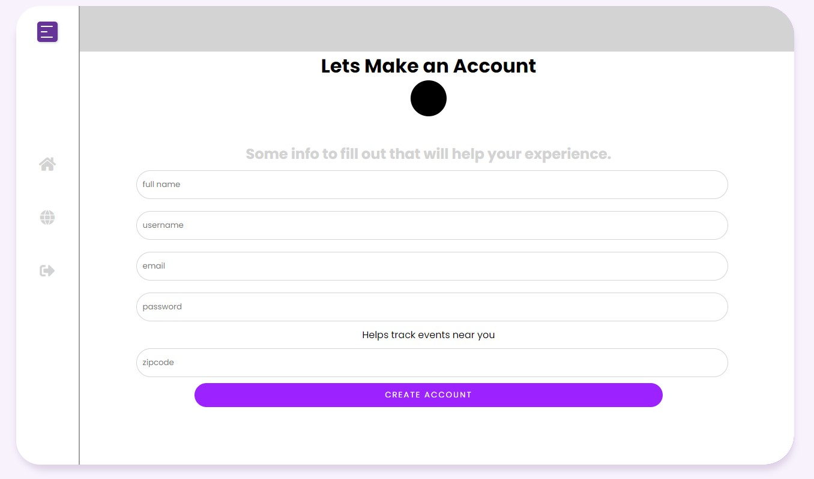

# Intended Purpose
This app is a mock-up of what a Covid-19 tracker web application will be. With it's main focus being UI/UX design, this project was built using React and an embedded Covid-19 tracker.

